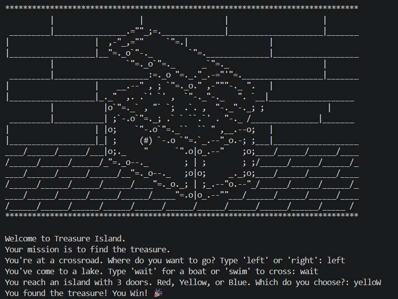
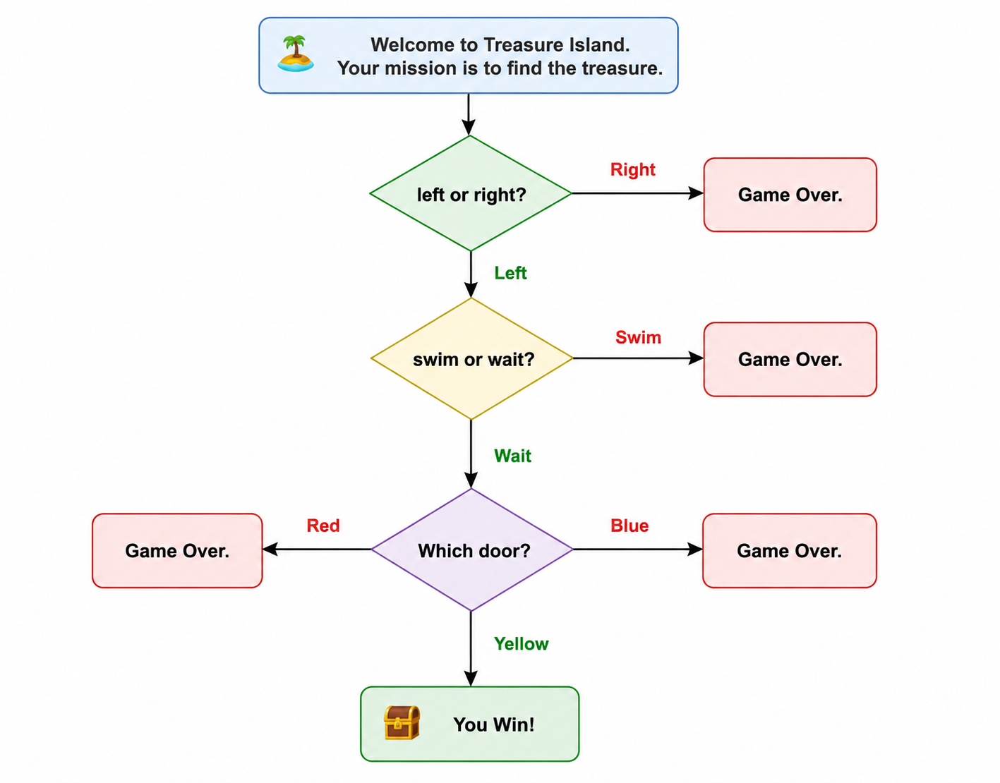

# python-treasure-island
# 🏝️ Treasure Island (Python CLI Game)

A text-based adventure game built in Python. Navigate choices 
to find the hidden treasure — or meet your doom.

## 🎮 How to Play
- Make choices at each stage: left/right, wait/swim, door color
- Only one path leads to the treasure
- Wrong choices = Game Over

## 🧠 What I Learned
- Nested if/elif/else logic
- `.lower()` for clean user input handling
- Building multi-stage decision trees
- ASCII art in Python using triple quotes

## ▶️ How to Run
```bash
python treasure_island.py
```

## 📸 Screenshot

## 🗺️ Game Flowchart


Built as part of [100 Days of Code](https://www.udemy.com/course/100-days-of-code/) – Day 3